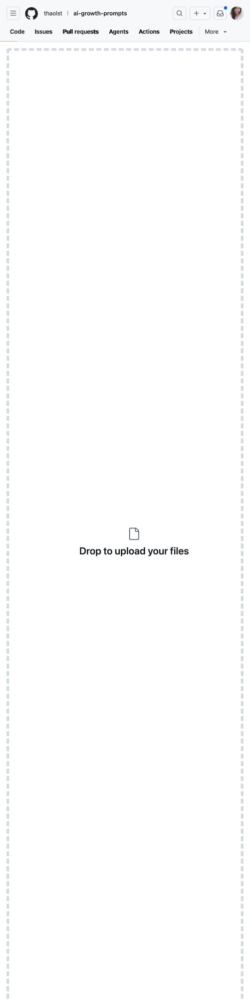

# Content Agent — Idea Suggester cho Personal Brand

  [](../README.md)

## Tiếng Việt

Agent này **không viết content** — chỉ gợi ý ý tưởng từ nội dung đã được duyệt trong repo.

Mỗi gợi ý gồm: chủ đề, góc nhìn, hook idea, folder tham chiếu.

Bạn tự viết — vì tone của bạn không AI nào bắt chước được.



Agent quét nội dung trong các folder để gợi ý chủ đề dựa trên nội dung đã duyệt.

### Cách dùng

```bash
git clone https://github.com/thaolst/ai-growth-prompts.git
cd ai-growth-prompts/13-content-agent
cp config.example.json config.json
# Sửa config.json: repo_path trỏ đến thư mục clone
python3 content-agent.py                  # gợi ý 3 ideas
```

### Ví dụ output

```text
💡 GỢI Ý CONTENT IDEA — hôm nay
Dựa trên nội dung đã duyệt trong repo

#1 — 02 · Phân tích segment
  Góc nhìn: Dormant 30 ngày vs 60 ngày — can thiệp khác nhau thế nào?
  Hook idea:
    • Chủ đề: 02 · Phân tích segment. Góc nhìn: chia sẻ kinh nghiệm thực tế từ repo.
  📁 02-segment-analysis

#2 — Growth Glossary / Thuật ngữ Growth
  Góc nhìn: Thuật ngữ AI cơ bản cho growth team
  📁 10-glossary

#3 — 05 - Automation Prompts
  Góc nhìn: Chia sẻ kinh nghiệm thực tế từ repo
  📁 05-automation
```

Chạy xong, chọn ý thích, tự viết theo tone của bạn, track performance sau khi đăng.

### Cấu trúc file

```
13-content-agent/
├── README.md
├── SKILL.md
├── content-agent.py        ← main agent (chạy được luôn)
├── config.example.json     ← config mẫu
└── config.json             ← config thật (đã .gitignore)
```

### Yêu cầu

- Python 3.8+
- Telegram bot token (tuỳ chọn — nhận gợi ý qua Telegram)

---

## English

This agent **does not write content** — it suggests ideas based on approved repo content.

Each suggestion includes: topic, angle, hook ideas, folder reference.

You write — because your tone is unique.

### Usage

```bash
cp config.example.json config.json
python3 content-agent.py                  # suggest 3 ideas
```
